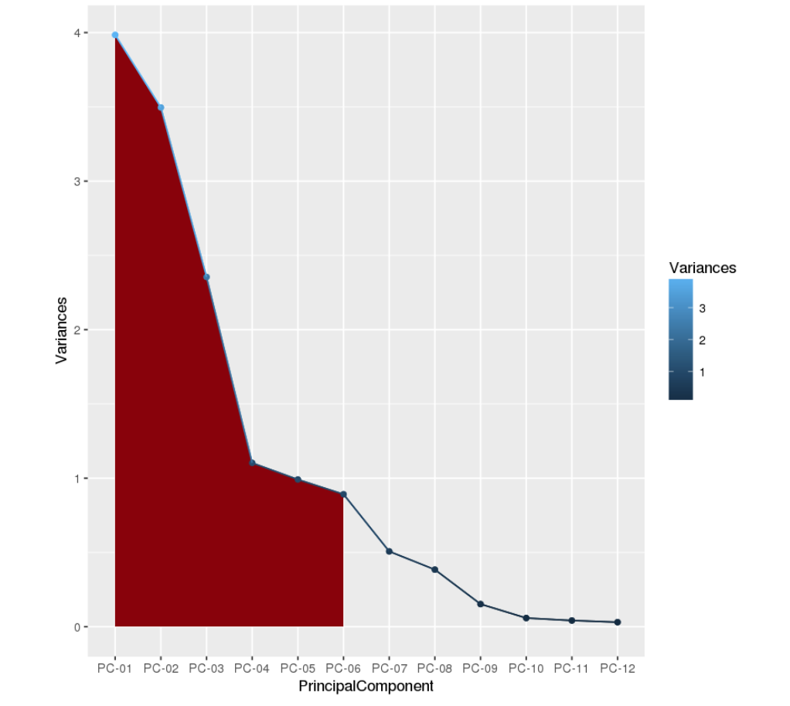

# R4ML을 활용한 빅데이터 준비와 탐색
*다른 언어로 보기: [English](README.md).*

이 코드 패턴에서는 확장 가능한 R 패키지인 R4ML을 IBM Watson Studio에서 실행하여, 다양한 머신 러닝 기법을 실습해 볼 것입니다. Watson Studio는 인터렉티브하고 협업이 쉬운 클라우드 기반 개발환경입니다.

Watson Studio를 통해 데이터 사이언티스트, 개발자, 그리고 데이터 사이언스에 관심이 있는 누구나 Jupyter Notebooks, Spark와 같은 툴을 활용하여, 쉽게 공유 및 협업하고 데이터에서 인사이트를 수집할 수 있습니다. 

이 코드 패턴을 마치면 다음의 방법을 배울 수 있습니다.

* [Jupyter Notebooks](http://jupyter.org/)을 사용하여 데이터 로드, 시각화, 분석
* [IBM Watson Studio](https://dataplatform.ibm.com)에서 Jupyter Notebooks 실행
* [R4ML](https://github.com/CODAIT/r4ml)을 활용하여 빅데이터 준비와 탐색적 데이터 분석 수행

이 코드 패턴은 확장가능한 피쳐 엔지니어링(feature engineering)과 데이터 탐색을 수행하려는 데이터 사이언티스트에게 적합한 과정일 것입니다. 

이 코드 패턴은 데이터 분석에 대한 end-to-end 사례를 제공하기 때문에, 데이터 전처리와 탐색을 구현하는 데 있어 R4ML이 얼마나 쉽고 강력한 지 보여주는 좋은 예가 될 것 입니다. R4M은 별다른 설정없이 바로 사용 가능한 툴들과 피쳐 엔지니어링(feature engineering)을 위한 전처리 유틸리티를 제공합니다. 또한 데이터를 샘플링하고 탐색적 분석을 수행할 수 있는 유틸리티도 제공합니다. 추가 기능, 지원, 문서, 로드맵 등 더 많은 정보를 원하시면 [R4ML](https://github.com/CODAIT/r4ml)에 방문하세요.

이 코드 패턴에서는 다음과 같은 단계를 진행합니다.

* 대용량의 탐색적 데이터 분석과 데이터 준비
* 차원 축소 (Dimensionality reduction)
* 빅데이터에 R 유틸리티를 사용하는 방법 습득
* 데이터 준비와 탐색에 중요한 단계들 짚고 넘어가기

### 데이터 원천

- [RITA](http://www.rita.dot.gov)로 부터 받은 비행기 정시율 통계 및 지연 원인에 대한 [데이터](http://stat-computing.org/dataexpo/2009/the-data.html)를 활용합니다.  모든 데이터는 public domain입니다.
- 위 데이터 세트 중에서, R4ML에 탑재할 수 있는 하위 세트를 사용할 것입니다.
- 더욱 큰 사이즈의 RITA 데이터세트와도 작동 가능합니다.

 
## 순서


1. 제공된 Notebook을 IBM Watson Studio에 불러옵니다.
2. 이 Notebook은 Apache Spark 인스턴스와 상호작용합니다. 
3. 빅데이터 데이터세트 샘플을 Jupyter Notebook으로 불러옵니다.
4. Apache Spark에서 실행되는 R4ML을 활용하여, 데이터 전처리와 탐색적 데이터 분석을 수행합니다.

# 구성요소

* [IBM Watson Studio](https://dataplatform.ibm.com): Spark와 같은 IBM value-adds가 포함된 협업 개발환경에서,  RStudio, Jupyter, Python을 사용하여 데이터를 분석합니다. 
* [IBM Analytics for Apache Spark](https://console.ng.bluemix.net/catalog/services/apache-spark): 초고속 및 대용량 데이터 프로세싱을 위한 오픈소스 클러스터 컴퓨팅 프레임워크
* [Jupyter Notebooks](http://jupyter.org/): 라이브 코드, 방정식, 시각화 및 설명 텍스트가 포함하는 문서를 만들고 공유 할 수있는 오픈 소스 웹 애플리케이션입니다.

## Featured Technologies

* [Data Science](https://medium.com/ibm-data-science-experience/): 인사이트 추출을 위한 정형 데이터 및 비정형 데이터 분석 시스템 및 방법
* [R4ML](https://github.com/CODAIT/r4ml): R, Apache SystemML, Apache Spark를 사용하는 확장가능한 하이브리드 ML/Stats 접근법

# 단계

이 코드 패턴은 다음의 활동들로 구성됩니다.

* [Jupyter notebooks을 IBM Watson Studio에서 실행하기](#IBM-Watson-Studio에서-Jupyter-Notebooks-실행하기).
* [데이터 탐색과 분석 수행하기](#데이터-탐색과-분석-수행하기).

## IBM Watson Studio에서 Jupyter Notebooks 실행하기

1. [Watson Studio 가입](#1-Watson-Studio-가입)
2. [새로운 Watson Studio 프로젝트 생성](#2-새로운-Watson-Studio-프로젝트-생성)
3. [Spark 서비스 생성](#3-Spark-서비스-생성)
4. [노트북 생성](#4-노트북-생성)
5. [노트북 실행](#5-노트북-실행)
6. [저장 및 공유](#6-저장-및-공유)

### 1. Watson Studio 가입

IBM이 제공하는 [Watson Studio](https://dataplatform.ibm.com)에 가입합니다.

> 참고: 만약, Watson Studio 셋업 과정을 건너뛰고 완성된 노트북을 간단히 확인하고 싶다면, 다음의 방법을 시도하세요.
> * 완성된 노트북과 결과물을 그대로 확인하세요. 이번 코드 패턴에서는 2개의 노트북을 사용합니다. [첫번째는](https://github.com/IBM/r4ml-on-watson-studio/tree/master/notebooks/R4ML_Introduction_Exploratory_DataAnalysis.ipynb) 탐색을 위해, [두번째는](https://github.com/IBM/r4ml-on-watson-studio/tree/master/notebooks/R4ML_Data_Preprocessing_and_Dimension_Reduction.ipynb) 데이터 전처리와 차원 축소 분석을 위해 사용됩니다.
> * 노트북을 보면서, 나중에 사용하기 위해 이를 다운로드하여 저장할 수도 있습니다.
> * 단계가 완료되면 [Explore and Analyze the Data](#explore-and-analyze-the-data) 섹션에서 이 코드 패턴에 대한 학습을 이어나가세요.

### 2. 새로운 Watson Studio 프로젝트 생성

* Watson Studio 페이지에서 `New Project` 를 클릭하고, 다음 창에서 `Data Science` 를 선택하세요.


* Watson Studio에서 프로젝트를 생성하기 위해, 프로젝트명(Name)을 입력하고 새로운 `Cloud Object Storage` 서비스를 생성하거나, 존재하는 IBM Cloud 계정을 선택하여 입력하세요. 


* 성공적인 프로젝트 생성을 위해서는, 프로젝트의 대시보드를 잘 살펴보세요. `Assets` 과 `Settings` 탭은 프로젝트를 다른 외부 자원(데이터 세트, 노트북 등), 그리고 IBM Cloud 서비스와 연결하기 위해 활용될 것입니다.


## 3. Spark 서비스 생성

* 프로젝트에서  `Settings` 탭을 클릭하여 진입하고,   `Associated Services` 로 쭉 내려가, `+ Add service`를 클릭하고, 리스트 중 `Spark`를 선택하세요.
 


*  `Existing` 탭으로 기존의 Spark 서비스를 선택하거나,   `New`를 통해 새로운 서비스를 생성하세요.


### 4. 노트북 생성

* 프로젝트 대시보드 화면에서  `Assets` 탭을 클릭한 뒤,  `+ New notebook` 버튼을 클릭하세요.


* 노트북에 노트북명을 부여하고, 희망하는 runtime은 관련된 Spark runtime으로 선택하세요.

> 참고: 이 코드 패턴에서는 runtime을 여러분의  `Spark` 인스턴스로 선택한 후, language를 `R`로 선택하세요.


* 이제 `From URL` 탭을 선택하여, 저장소의 노트북으로 연결되는 URL을 설정해줍니다. 


* 다음의 URL을 입력하세요:

```
https://github.com/IBM/r4ml-on-watson-studio/blob/master/notebooks/R4ML_Introduction_Exploratory_DataAnalysis.ipynb
```

* `Create` 버튼은 클릭하세요.

* 같은 과정을 반복하여, 이제 두번째 노트북을 생성하세요. 이번 노트북의 URL은 다음과 같습니다.

```
https://github.com/IBM/r4ml-on-watson-studio/blob/master/notebooks/R4ML_Data_Preprocessing_and_Dimension_Reduction.ipynb
```

### 5. 노트북 실행

먼저, 탐색적 분석을 위한 첫번째 노트북을 실행합니다. 첫번째 노트북 실행이 완료된 후에는, 데이터 처리를 위한 두번째 노트북을 실행합니다.

> 참고: 탐색적 분석 노트북을 꼭 먼저 실행해야 합니다. 첫번째 노트북을 실행하며, 데이터 처리 노트북에서 필요한 라이브러리와 패키지를 불러올 것이기 때문입니다. 

노트북이 실행되는 것은, 노트북 내의 각각의 코드 셀이 위에서 아래로 순서에 따라 실행되는 것입니다. 

각각의 코드 셀은 선택이 가능하고, 좌편의 태그가 먼저 읽혀집니다. 태그는  `In [x]:`의 형식입니다. 노트북의 상태에 따라, `x` 는 다음을 의미합니다.

* 비어있음: 셀은 아직 실행된 적 없는 상태입니다.
* 숫자: 이 숫자는 해당 코드 스텝이 수행되는 상대적인 순서를 의미합니다.
* `*`: 셀이 현재 실행 중임을 의미합니다.

노트북에서 코드 셀을 실행하는 몇가지 방법이 있습니다:

* 한 번에 한 셀씩
  * 셀을 선택하고, 툴바의 `Play` 버튼을 클릭합니다.
* 순차적인 Batch 모드
  * `Cell` 메뉴 바에서, 몇가지 옵션을 활용할 수 있습니다. 예를 들어, `Run All` 로 모든 셀을 실행하거나, `Run All Below`로 현재 선택된 셀의 위치의 아래 셀부터 실행할 수도 있습니다. 
* 정해진 시간에
  *  노트북 패널의 우측 상단에 위치한  `Schedule`  버튼을 누르면, 미래의 특정 시간에 노트북이 한 번 실행될 수 있도록 하거나, 원하는 시간 간격에 따라 실행이 반복되도록 설정할 수 있습니다.

### 6. 저장 및 공유

#### 작업을 저장하는 방법

 `File` 메뉴 아래에, 노트북을 저장하는 몇가지 방법이 있습니다.

* `Save` 버튼은 버전 정보 없이, 간단하게 노트북의 현재 상태를 저장할 것입니다. 
* `Save Version` 버튼은 시간과 타임 스탬프가 포함된 버전 태그와 함께 노트북의 현재 상태를 저장할 것입니다. 한 노트북에서 최대 10개의 버전까지 저장할 수 있고, 각각의 버전은  `Revert To Version` 메뉴를 클릭하여 이전 상태로 복구 가능합니다. 

#### 작업을 공유하는 방법

노트북 패널의 우측 상단에 위치한 `Share` 버튼을 클릭하여 노트북을 공유할 수 있습니다. 노트북의 "읽기 전용" 버전과 연결되는 URL 링크가 생성됩니다. 다음과 같이 노트북에서 공유를 원하는 것을 구체적으로 지정할 수 있습니다.

* `Only text and output`: 노트북 화면에서 모든 코드 셀을 삭제할 것입니다. 
* `All content excluding sensitive code cells`:  *sensitive* 태그를 포함한 코드 셀을 삭제할 것입니다. 예를 들어,  `# @hidden_cell` 는 여러분의 신임정보가 공유되는 것을 방지합니다.
* `All content, including code`: 노트북을 있는 그대로 보여줍니다.
* 다양한 `download as` 저장 옵션도 사용 가능합니다.

## 데이터 탐색과 분석 수행하기

두 노트북 모두 문서화 되어 있어, 실습에 대한 가이드가 되어 줄 것입니다. 앞으로 다룰 주요 작업은 다음과 같습니다.

* 패키지와 데이터를 로드하여 초기 변환작업과(transformation) 다양한 피쳐 엔지니어링(feature engineering)을 수행합니다.

* 데이터 세트를 샘플링하고, R의 강력한 ggplot2 라이브러리를 활용하여 다양한 탐색적 분석을 수행합니다. 

* PCA (Principal Component Analysis)를 실행하여 데이터세트의 차원을 축소시키고, 분산의 90%를 커버할 수 있는 k 컴포넌트를 선택합니다.  

여러분은 git에서 다운로드 가능한 IBM의 오픈소스 R 패키지인 R4ML의 장점을 알게 되실 것입니다. 대표적인 장점은 다음과 같습니다.

* SparkR과 Apache SystemML, 두 가지의 모드에서 생성할 수 있고 모든 기능을 지원합니다.

* SparkR과 Apache SystemML을 연결하는 다리와 같은 역할을 합니다.

* canned 알고리즘에 대한 컬렉션을 제공합니다.

* 커스텀 ML 알고리즘 생성 기능을 제공합니다. 

* SparkR과 Apache SystemML 기능성을 모두 충족시킵니다.

* R 사용자들에게 친숙한 API입니다.

## 샘플 결과물

다음 화면은 히스토그램으로 표현된 탐색적 분석 결과를 보여줍니다.


다음 화면은 탐색적 분석을 통해 도출된 다양한 특징 간의 연관관계를 보여줍니다.


다음 화면은 PCA를 활용하여, 어떻게 6개의 PCA 컴포넌트가 90%의 정보를 전달하는 지를 보여주는 차원 감소 분석 결과입니다.



여기까지 따라 오시느라 수고하셨습니다! 이제 실제로 실습해보시고, 더욱 심화하거나 다른 사례에 활용해보세요.

## 링크

 - Watson Studio: https://datascience.ibm.com/docs/content/analyze-data/creating-notebooks.html.
 - Data: http://stat-computing.org/dataexpo/2009/the-data.html

# 자세히 보기

* **데이터 분석 코드 패턴**: 이 과정이 즐거우셨나요? 다른 [데이터 분석 코드 패턴](https://developer.ibm.com/code/technologies/data-science/)도 확인해보세요.
* **AI, 데이터 코드 패턴 플레이리스트**: 저희의 모든 코드 패턴 비디오가 있는 [플레이리스트](https://www.youtube.com/playlist?list=PLzUbsvIyrNfknNewObx5N7uGZ5FKH0Fde)를 북마크하세요.
* **Watson Studio**: IBM의 [Watson Studio](https://dataplatform.ibm.com/)로 데이터 사이언스의 고수가 되어보세요.
* **Spark on IBM Cloud**: Spark cluster가 필요하신가요? IBM Cloud에서 저희의 [Spark service](https://console.bluemix.net/catalog/services/apache-spark)로 최대 30개의 Spark executers를 생성해보세요.

# 라이센스

이 코드 패턴은 Apache Software License, Version 2에 따라 사용이 허가됩니다.이 코드 패턴 내에서 호출되는 별도의 제 3 자 코드 객체는 각각의 개별 라이센스에 따라 해당 제공자가 라이센스를 부여합니다. 기고물에는 the Developer [Certificate of Origin, Version 1.1 (DCO)](https://developercertificate.org/) 및 [Apache Software License, Version 2](http://www.apache.org/licenses/LICENSE-2.0.txt)이 적용됩니다. 

ASL FAQ link: http://www.apache.org/foundation/license-faq.html#WhatDoesItMEAN

