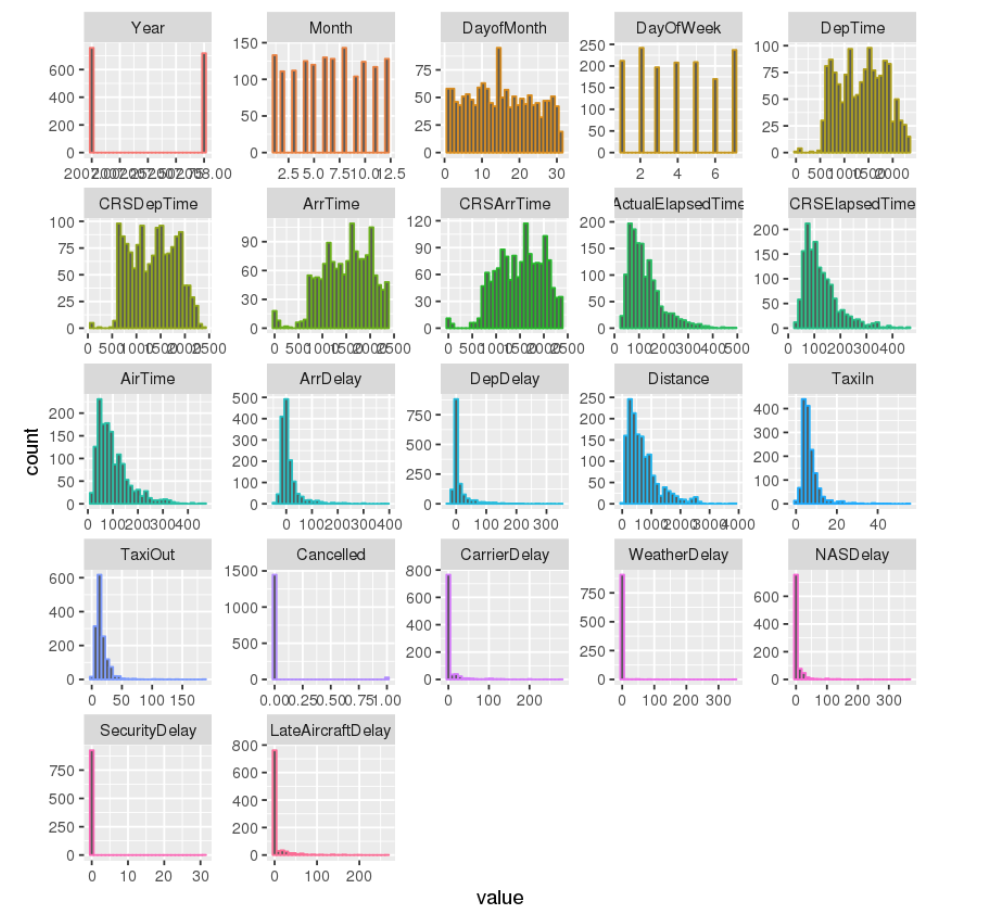
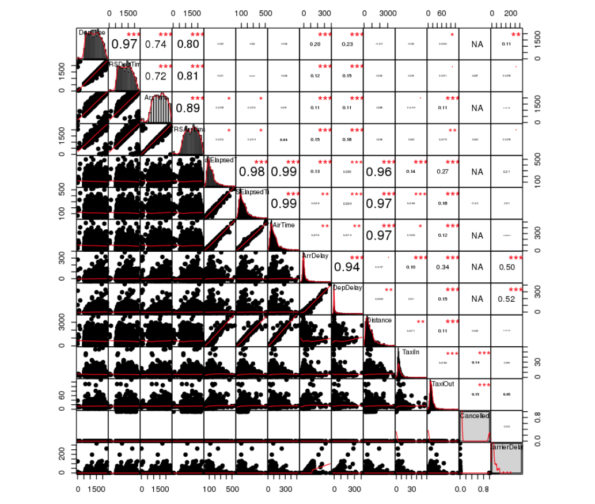
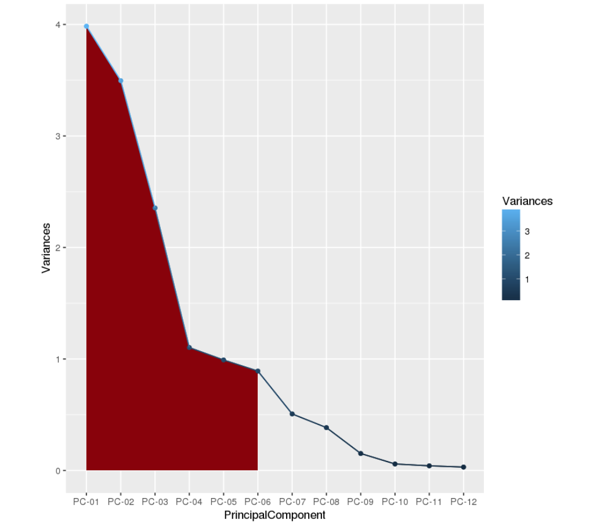

# Big Data Preparation and Exploration using R4ML

*Read this in other languages: [한국어](README-ko.md).*

In this Code Pattern we will use R4ML, a scalable R package, running on IBM Watson Studio to perform various Machine Learning exercises. For those users who are unfamiliar with Watson Studio, it is an interactive, collaborative, cloud-based environment where data scientists, developers, and others interested in data science can use tools (e.g., RStudio, Jupyter Notebooks, Spark, etc.) to collaborate, share, and gather insight from their data.

When the reader has completed this Code Pattern, they will understand how to:

* Use [Jupyter Notebooks](https://jupyter.org/) to load, visualize, and analyze data.
* Run Notebooks in [IBM Watson Studio](https://dataplatform.cloud.ibm.com/).
* Leverage [R4ML](https://github.com/CODAIT/r4ml) to conduct data preparation and exploratory analysis with big data.

The Intended audience for this Code Pattern is data scientists who wish to perform scalable feature engineering and data exploration.

This specific Code Pattern will provide an end-to-end example to demonstrate the ease and power of R4ML in implementing data preprocessing and data exploration. R4ML provides various out-of-the-box tools, and a preprocessing utility for doing the feature engineering. It also provides utilities to sample data and do exploratory analysis. For more information about additional R4ML functionality, support, documentation, and roadmap, please vist [R4ML](https://github.com/CODAIT/r4ml)

This Code Pattern will walk the user through the following conceptual steps:

* Large-scale exploratory analytics and data preparation.
* Dimensionality reduction.
* How to use your favorite R utilities on big data.
* Highlights the steps necessary to complete data preparation and exploration.

#### Source of data

* We will use the Airline On-Time Statistics and Delay Causes from [RITA](https://www.transportation.gov/research-technology). A 1% sample of the "airline" dataset is available [here](http://stat-computing.org/dataexpo/2009/the-data.html). All of the data is in the      public domain.
* For this Code Pattern, we will use a subset of the above dataset, which is shipped with R4ML
* This Code Pattern can also work with the larger RITA dataset.

#### Notebooks

* [R4ML_Introduction_Exploratory_DataAnalysis.ipynb](notebooks/R4ML_Introduction_Exploratory_DataAnalysis.ipynb): for exploring the data we will be using
* [R4ML_Data_Preprocessing_and_Dimension_Reduction.ipynb](notebooks/R4ML_Data_Preprocessing_and_Dimension_Reduction.ipynb):  performs data pre-processing and dimension reduction analysis.

## Flow

1. Load the provided notebook into IBM Watson Studio.
2. The notebook interacts with an Apache Spark instance.
3. A sample big data dataset is loaded into a Jupyter Notebook.
4. R4ML, running atop Apache Spark, is used to perform machine data preprocessing and exploratory analysis.

# Included Components

* [IBM Watson Studio](https://dataplatform.cloud.ibm.com/): Analyze data using RStudio, Jupyter, and Python in a configured, collaborative environment that includes IBM value-adds, such as managed Spark.
* [IBM Analytics for Apache Spark](https://cloud.ibm.com/catalog/services/apache-spark): An open-source cluster computing framework optimized for extremely fast and large scale data processing.
* [Jupyter Notebooks](https://jupyter.org/): An open-source web application that allows you to create and share documents that contain live code, equations, visualizations and explanatory text.

## Featured Technologies

* [Data Science](https://medium.com/ibm-data-science-experience/): Systems and scientific methods to analyze structured and unstructured data in order to extract knowledge and insights.
* [R4ML](https://github.com/CODAIT/r4ml): R4ML is a scalable, hybrid approach to ML/Stats using R, Apache SystemML, and Apache Spark.

## Steps

1. [Create a new Watson Studio project](#1-create-a-new-watson-studio-project)
2. [Create the notebooks](#2-create-the-notebooks)
3. [Run the notebooks](#3-run-the-notebooks)
4. [Save and Share](#4-save-and-share)
5. [Explore and Analyze the Data](#5-explore-and-analyze-the-data)

### 1. Create a new Watson Studio project

* Log into IBM's [Watson Studio](https://dataplatform.cloud.ibm.com). Once in, you'll land on the dashboard.

* Create a new project by clicking `+ New project` and choosing `Data Science`:

  

* Enter a name for the project name and click `Create`.

* **NOTE**: By creating a project in Watson Studio a free tier `Object Storage` service and `Watson Machine Learning` service will be created in your IBM Cloud account. Select the `Free` storage type to avoid fees.

  

* Upon a successful project creation, you are taken to a dashboard view of your project. Take note of the `Assets` and `Settings` tabs, we'll be using them to associate our project with any external assets (datasets and notebooks) and any IBM cloud services.

  

### 2. Create the Notebooks

* From the new project `Overview` panel, click `+ Add to project` on the top right and choose the `Notebook` asset type.

* Fill in the following information:

  * Select the `From URL` tab. [1]
  * Enter a `Name` for the notebook and optionally a description. [2]
  * Under `Notebook URL` provide the following url: [https://github.com/IBM/r4ml-on-watson-studio/blob/master/notebooks/R4ML_Introduction_Exploratory_DataAnalysis.ipynb](https://github.com/IBM/r4ml-on-watson-studio/blob/master/notebooks/R4ML_Introduction_Exploratory_DataAnalysis.ipynb) [3]
  * For `Runtime` select the `Spark R 3.4` option. [4]

  

* Click the `Create` button.

* Repeat these steps for the second notebook, which has the URL: [https://github.com/IBM/r4ml-on-watson-studio/blob/master/notebooks/R4ML_Data_Preprocessing_and_Dimension_Reduction.ipynb](https://github.com/IBM/r4ml-on-watson-studio/blob/master/notebooks/R4ML_Data_Preprocessing_and_Dimension_Reduction.ipynb)

* **TIP:** Once successfully imported, the notebook should appear in the `Notebooks` section of the `Assets` tab.

### 3. Run the notebooks

First run the exploratory nodebook first. Once Complete, run the data processing notebook.

> Note: Running the exploratory notebook first is a requirement. It loads libraries and packages that are required in the data processing notebook.

When a notebook is executed, what is actually happening is that each code cell in
the notebook is executed, in order, from top to bottom.

Each code cell is selectable and is preceded by a tag in the left margin. The tag
format is `In [x]:`. Depending on the state of the notebook, the `x` can be:

* A blank, this indicates that the cell has never been executed.
* A number, this number represents the relative order this code step was executed.
* A `*`, this indicates that the cell is currently executing.

There are several ways to execute the code cells in your notebook:

* One cell at a time.
  * Select the cell, and then press the `Play` button in the toolbar.
* Batch mode, in sequential order.
  * From the `Cell` menu bar, there are several options available. For example, you
    can `Run All` cells in your notebook, or you can `Run All Below`, that will
    start executing from the first cell under the currently selected cell, and then
    continue executing all cells that follow.
* At a scheduled time.
  * Press the `Schedule` button located in the top right section of your notebook
    panel. Here you can schedule your notebook to be executed once at some future
    time, or repeatedly at your specified interval.

### 4. Save and Share

#### How to save your work:

Under the `File` menu, there are several ways to save your notebook:

* `Save` will simply save the current state of your notebook, without any version
  information.
* `Save Version` will save your current state of your notebook with a version tag
  that contains a date and time stamp. Up to 10 versions of your notebook can be
  saved, each one retrievable by selecting the `Revert To Version` menu item.

#### How to share your work:

You can share your notebook by selecting the `Share` button located in the top
right section of your notebook panel. The end result of this action will be a URL
link that will display a “read-only” version of your notebook. You have several
options to specify exactly what you want shared from your notebook:

* `Only text and output`: will remove all code cells from the notebook view.
* `All content excluding sensitive code cells`:  will remove any code cells
  that contain a *sensitive* tag. For example, `# @hidden_cell` is used to protect
  your credentials from being shared.
* `All content, including code`: displays the notebook as is.
* A variety of `download as` options are also available in the menu.

### 5. Explore and Analyze the Data

Both notebooks are well documented and will guide you through the exercise. Some of the main tasks that will be covered include:

* Load packages and data and do the initial transformation and various feature engineering.

* Sample the dataset and use the powerful ggplot2 library from R to do various exploratory analysis.

* Run PCA (Principal Component Analysis) to reduce the dimensions of the dataset and select the k components to cover 90% of variance.

You will also see the advantages of using R4ML, which is a git-downloadable open-source R packaged from IBM. Some of these include:

* Created on top of SparkR and Apache SystemML, so it supports features from both.

* Acts as an R bridge between SparkR and Apache SystemML.

* Provides a collection of canned algorithms.

* Provides the ability to create custom ML algorithms.

* Provides both SparkR and Apache SystemML functionality.

* APIs that should be familiar to R users.

## Sample output

The following screen-shots shows the histogram of the exploratory analysis.

The following screen-shots shows the correlation between various features of the exploratory analysis.

The following screen-shots shows the output of the dimensionality reduction using PCA and how only 6 components of PCA carries 90% of information.

Awesome job following along! Now go try and take this further or apply it to a different use case!

## Links

* [Data Set](http://stat-computing.org/dataexpo/2009/the-data.html)

## Learn more

* **Data Analytics Code Patterns**: Enjoyed this Code Pattern? Check out our other [Data Analytics Code Patterns](https://developer.ibm.com/technologies/data-science/)
* **AI and Data Code Pattern Playlist**: Bookmark our [playlist](https://www.youtube.com/playlist?list=PLzUbsvIyrNfknNewObx5N7uGZ5FKH0Fde) with all of our Code Pattern videos
* **Watson Studio**: Master the art of data science with IBM's [Watson Studio](https://dataplatform.cloud.ibm.com/)

## License

This code pattern is licensed under the Apache License, Version 2. Separate third-party code objects invoked within this code pattern are licensed by their respective providers pursuant to their own separate licenses. Contributions are subject to the [Developer Certificate of Origin, Version 1.1](https://developercertificate.org/) and the [Apache License, Version 2](https://www.apache.org/licenses/LICENSE-2.0.txt).

[Apache License FAQ](https://www.apache.org/foundation/license-faq.html#WhatDoesItMEAN)
